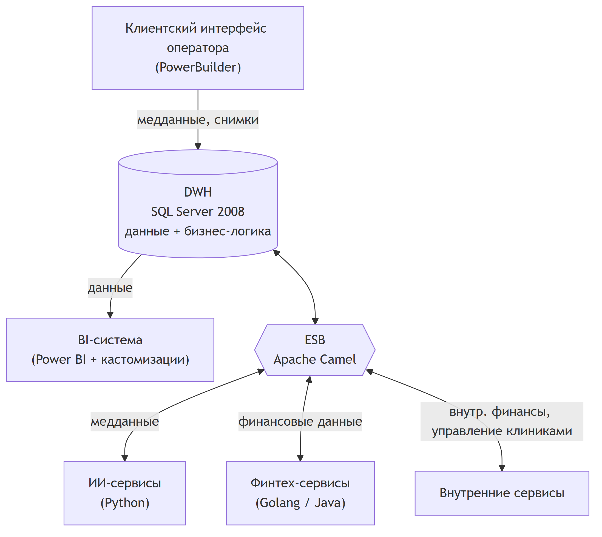
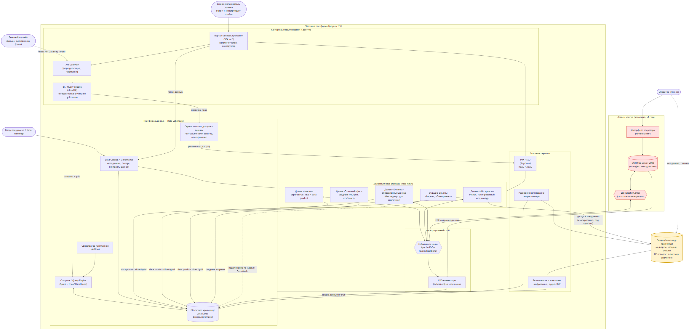

# Задание 1. Целевая архитектура и приоритизация проблем — «Будущее 2.0»

> Горизонт проектирования — **через год** (финальное состояние): реализован портал самообслуживания, бизнес-пользователи в доменах работают с данными в новой архитектуре, легаси-системы временно сохраняются в отдельных доменах.

Документ состоит из трёх частей:
1. [Целевая архитектура — диаграмма контейнеров C4](#1-целевая-архитектура-диаграмма-контейнеров-c4) и привязка к ключевым бизнес-сценариям.
2. [Анализ проблемных мест](#2-анализ-проблемных-мест) с указанием страдающих бизнес-сценариев.
3. [Приоритизация проблем](#3-приоритизация-проблем) (MoSCoW + матрица Эйзенхауэра) с привязкой к целям бизнеса.

Дополнительно:
- Исходник C4-диаграммы для PlantUML — [`c4-container.puml`](./c4-container.puml).
- Сводка текущего состояния (AS-IS) — [см. раздел 1.1](#11-исходное-состояние-as-is).

---

## 1. Целевая архитектура. Диаграмма контейнеров C4

### 1.1. Исходное состояние (AS-IS)

Сегодня весь ландшафт замкнут на два центральных «узких горла»:

- **DWH на SQL Server 2008** — хранит всё (клиенты, медкарты, финансы, кредиты, счета, персонал, инвентаризация, отчётность) и содержит основную бизнес-логику.
- **ESB на Apache Camel** — единая точка интеграции между DWH, ИИ-сервисами, финтех-сервисами и внутренними сервисами.



**Главный архитектурный анти-паттерн:** DWH одновременно является и операционной БД, и аналитическим хранилищем, и местом хранения бизнес-логики, и интеграционным хабом. Любое новое бизнес-направление требует доработки логики внутри DWH → растёт связанность, падает скорость и производительность.

### 1.2. Целевое состояние (TO-BE) — диаграмма контейнеров C4

Целевая архитектура строится на трёх идеях:
- **Облачный Data Lakehouse** (bronze → silver → gold) как единая масштабируемая платформа данных вместо монолитного DWH.
- **Data Mesh**: данные принадлежат доменам, каждый домен публикует свои **data products**; новые бизнесы подключаются по той же модели без правок «центра».
- **Портал самообслуживания** поверх gold-слоя: сотрудник сам строит отчёты в пределах своего уровня доступа.



> Канонический исходник той же диаграммы в нотации **C4-PlantUML** — в файле [`c4-container.puml`](./c4-container.puml) (можно отрендерить на <https://www.plantuml.com/plantuml> или через расширение PlantUML).

### 1.3. Как целевая архитектура поддерживает ключевые бизнес-сценарии

| Бизнес-сценарий | Как обеспечивается в целевой архитектуре |
|---|---|
| **Быстрая подготовка отчётности** (сейчас — часы) | Заранее подготовленный **gold-слой** Lakehouse + колоночный движок (Trino/ClickHouse) + кэш. Отчёты строятся на готовых витринах, без тяжёлых ad-hoc трансформаций поверх операционного DWH → секунды/минуты вместо часов. |
| **Портал самообслуживания** (любые срезы в пределах доступа, свои отчёты) | `Портал` + `BI-сервис` поверх gold-слоя; `Data Catalog` для поиска данных; `Сервис политик` (row/column-level security) гарантирует, что пользователь видит только разрешённое. |
| **Независимое развитие финтех- и ИИ-направлений** | Каждое направление — **отдельный домен** со своими сервисами и data product. Изменения внутри домена не требуют правок «центра» (DWH). Финтех (Go/Java) и ИИ (Python) развиваются и релизятся независимо. |
| **Масштабирование под новые бизнесы** (фарма, электроника) | Новый бизнес = новый домен, подключаемый по единой модели **Data Mesh**: публикует свой data product в Lakehouse через контракт данных. Центральная команда не становится «бутылочным горлом». |
| **Снижение бизнес-логики в DWH** | Логика выносится в доменные сервисы и пайплайны Lakehouse. DWH переводится в режим **strangler** — данные мигрируют через CDC, логика поэтапно отключается. |
| **Изоляция медицинских данных** | Медкарты, истории и снимки хранятся в **отдельном защищённом контуре** (`Мед-хранилище`) и **не попадают в витрину**. Доступ к ним — только у ИИ-домена, изолированно и под аудитом. |
| **Надёжность, ИБ и комплаенс** | Сквозные сервисы: `IAM/SSO`, `Безопасность и комплаенс` (шифрование, аудит, DLP), `Резервное копирование + гео-репликация` для критичных систем. |

---

## 2. Анализ проблемных мест

Проблемы текущего ландшафта (AS-IS) с указанием, какие **бизнес-сценарии** от них страдают.

| # | Проблемное место | Суть проблемы | Какие бизнес-сценарии страдают | Бизнес-эффект |
|---|---|---|---|---|
| **P1** | **Монолитный DWH как единая точка** | Один SQL Server 2008 хранит все данные и почти всю бизнес-логику. Любое изменение затрагивает всех. | Развитие финтех/ИИ-направлений; интеграция новых бизнесов; быстрая отчётность | Высокая связанность, рост time-to-market, хрупкость изменений |
| **P2** | **Часы на построение отчётов** | Сотни ТБ + множество сценариев → масса трансформаций «на лету» поверх операционного хранилища. | Быстрая подготовка отчётности; управленческие решения | Задержки в принятии управленческих решений, падение производительности аналитики |
| **P3** | **Отсутствие портала самообслуживания** | Отчёты делаются через кастомизации поверх DWH и BI-команду; самостоятельно сотрудник отчёт не построит. | Самообслуживание; масштабирование числа пользователей и направлений | Узкое место в виде BI-команды, очереди на отчёты |
| **P4** | **ESB как единственный интеграционный хаб** | Apache Camel — единая синхронная точка интеграции всех сервисов. | Независимое развитие доменов; интеграция новых бизнесов | Каскадные сбои, сложность подключения новых направлений |
| **P5** | **Устаревший стек (SQL Server 2008, PowerBuilder)** | EOL-технологии: нет поддержки, риски ИБ, дефицит специалистов, плохая масштабируемость. | Все сценарии; миграция в облако; надёжность | Технический долг, риск инцидентов, дорогая поддержка «железа» |
| **P6** | **Бизнес-логика «размазана» по DWH** | Логика под финтех и ИИ встроена в DWH → новые направления тянут логику в центр. | Интеграция новых бизнесов; независимость доменов | Невозможность развивать домены автономно |
| **P7** | **Риски ИБ и комплаенса для мед/фин данных** | Медицинские и финансовые данные в одном контуре без явной изоляции и тонкого разграничения доступа. | Качество мед/фин сервисов; соответствие регуляторам | Регуляторные штрафы, репутационные и юридические риски |
| **P8** | **Нет независимости сред/доменов** | Общая инфраструктура, нет изолированных сред под домены. | Независимое развитие; масштабирование | Конфликты релизов, общий «blast radius» при сбоях |
| **P9** | **Низкая отказоустойчивость и доступность** | Нет геораспределения и отказоустойчивости для критичных систем; on-prem железо. | Надёжность критичных мед/фин сервисов | Простои критичных сервисов, потеря данных |
| **P10** | **Медданные смешаны с аналитикой** | Нет чёткой границы: медкарты/снимки потенциально доступны аналитическим процессам, хотя для аналитики не нужны. | Комплаенс; качество мед-сервисов | Избыточная поверхность риска для чувствительных данных |

---

## 3. Приоритизация проблем

Применены два метода: **MoSCoW** (что обязательно для достижения целей года) и **матрица Эйзенхауэра** (срочность × важность). Приоритет связан с целями бизнеса: **выручка**, **time-to-market**, **качество мед/фин сервисов**, **масштабирование**.

### 3.1. MoSCoW

| Приоритет | Проблемы | Обоснование привязки к целям бизнеса |
|---|---|---|
| **Must have** (без этого цели года не достигаются) | **P1, P2, P3, P6** | Портал самообслуживания и быстрая отчётность — прямые цели проекта. Без декомпозиции DWH (P1, P6) и ускорения отчётности (P2) невозможен сам портал (P3). Напрямую влияет на **time-to-market** и **скорость управленческих решений**. |
| **Should have** (важно, сильно усиливает результат) | **P4, P7, P8** | Замена ESB событийной шиной (P4) и изоляция сред (P8) обеспечивают **независимое развитие** и **масштабирование** новых бизнесов. ИБ/комплаенс (P7) критичны для **качества фин/мед сервисов** и допуска регулятора — без них продукт нельзя выпускать в проде. |
| **Could have** (желательно, но можно поэтапно) | **P5, P9, P10** | Полный отказ от легаси-стека (P5) и геораспределение (P9) можно вести поэтапно (легаси допустимо временно сохранять). Явная физическая изоляция медданных (P10) частично закрывается решением P7. |
| **Won't have (сейчас)** | — | Все выявленные проблемы входят в годовой горизонт; «не делать» ничего не отнесено. |

### 3.2. Матрица Эйзенхауэра (срочность × важность)

```
                    ВАЖНО                          НЕ ТАК ВАЖНО
            ┌────────────────────────────┬────────────────────────────┐
            │  I. СДЕЛАТЬ СЕЙЧАС          │  II. ЗАПЛАНИРОВАТЬ          │
  СРОЧНО    │  P2  отчёты строятся часами │  P9  отказоустойчивость    │
            │  P7  ИБ/комплаенс мед+фин   │      / геораспределение    │
            │  P1  монолит DWH            │                            │
            ├────────────────────────────┼────────────────────────────┤
            │  III. (важно, несрочно)    │  IV. (несрочно, неважно)   │
  НЕ СРОЧНО │  P3  портал самообслуж.    │  P5  вывод легаси-стека    │
            │  P6  логика в DWH          │      (поэтапно, ≤1 года)   │
            │  P4  ESB → событийная шина │  P10 изоляция медданных    │
            │  P8  независимость сред    │      (частично в P7)       │
            └────────────────────────────┴────────────────────────────┘
```

- **Квадрант I (срочно + важно — делать первыми):** `P2`, `P7`, `P1`. Отчётность часами бьёт по выручке и решениям уже сейчас; риски мед/фин данных недопустимы при работе с регулятором; монолит DWH блокирует всё остальное.
- **Квадрант III (важно, несрочно — планировать и вести параллельно):** `P3`, `P6`, `P4`, `P8` — фундамент целевой архитектуры (портал, вынос логики, событийная интеграция, изоляция сред).
- **Квадрант II (срочно по SLA, но можно поэтапно):** `P9` — отказоустойчивость критичных систем при переезде в облако.
- **Квадрант IV (несрочно, делается фоном):** `P5`, `P10` — окончательный вывод легаси и физическая изоляция, допустимо растянуть на год.

### 3.3. Итоговый порядок работ (с привязкой к целям)

1. **P1 + P6 + P2** — разорвать монолит DWH, вынести логику, поднять gold-слой Lakehouse → **time-to-market, скорость решений, выручка**.
2. **P7** — контур ИБ/комплаенса (IAM, маскирование, изоляция мед/фин) → **допуск регулятора, качество мед/фин сервисов**.
3. **P3 + P4 + P8** — портал самообслуживания, событийная шина, независимые домены/среды → **масштабирование, независимое развитие**.
4. **P9** — отказоустойчивость и геораспределение критичных систем → **надёжность**.
5. **P5 + P10** — поэтапный вывод легаси и финальная изоляция медданных → **снижение техдолга и затрат**.

---

### Связь с другими заданиями
- Разделение на домены и потоки данных (DFD) детализируются в **Task2**.
- Технологический радар и роадмап изменений (с привязкой этапов к этой приоритизации) — в **Task3**.
- Облачная инфраструктура и IaC (Terraform) — в **Task4**.
