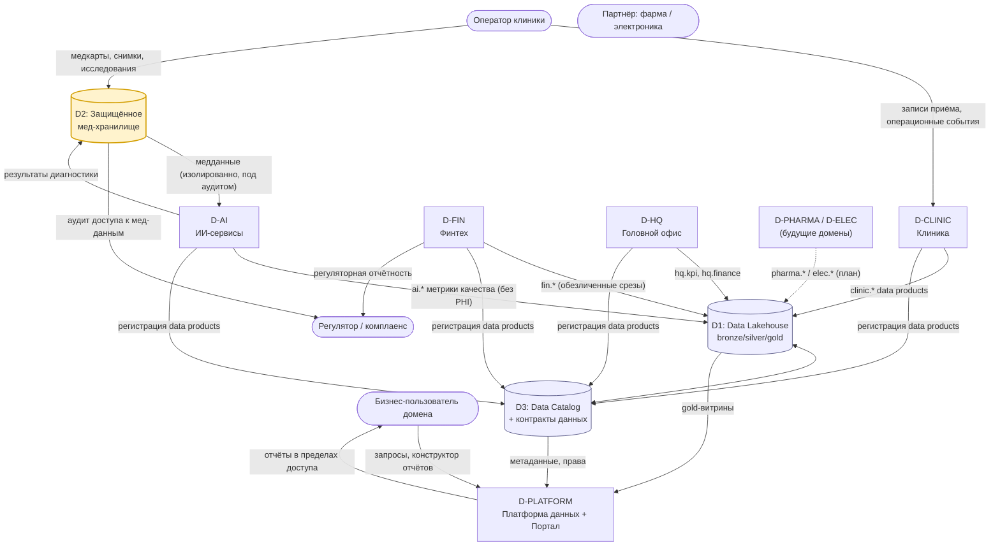
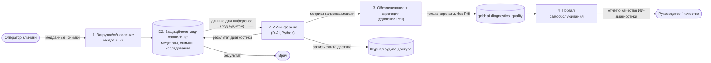

# Задание 2. Разделение на домены и моделирование потоков данных (DFD) — «Будущее 2.0»

Документ продолжает целевую архитектуру из [Task1](../Task1/README.md) и состоит из трёх частей:
1. [Разделение системы на домены](#1-разделение-системы-на-домены) и обоснование границ через бизнес-сценарии.
2. [Data Flow Diagram (DFD)](#2-data-flow-diagram-dfd): контекстный уровень и детализация ключевых сценариев.
3. [Аргументация логики разделения](#3-аргументация-логики-разделения-и-выгоды-для-бизнеса) и выгоды для бизнеса.

Цель разделения — дать направлениям развиваться **независимо**, **без внедрения новой бизнес-логики в DWH**.

---

## 1. Разделение системы на домены

Границы доменов проведены по **бизнес-способностям** (bounded contexts) и зонам ответственности подразделений, а не по техническим слоям. Применяется модель **Data Mesh**: каждый домен владеет своими операционными системами и публикует **data products** в общую платформу по контракту данных. Никакой домен не правит общий DWH — DWH выводится в режиме strangler.

### 1.1. Карта доменов

| Домен | Подразделение / источник | Что владеет (операционные данные) | Публикуемые data products | Стек |
|---|---|---|---|---|
| **D-CLINIC «Клиника»** | Клиники | Записи на приём, расписание, операционные события клиник, инвентаризация мед-оборудования | `clinic.operations`, `clinic.inventory`, `clinic.load` (загрузка/пропускная способность) | — |
| **D-MED «Медицинские данные»** (изолированный) | Клиники + ИИ | Медкарты, истории болезни, снимки, результаты исследований | **Не публикует в витрину** (только защищённый доступ для D-AI) | защищённое хранилище |
| **D-AI «ИИ-сервисы»** | Компания ИИ-сервисов | Модели, инференс, разметка, фичи для диагнозов | `ai.diagnostics_quality`, `ai.model_metrics` (агрегаты, без PHI) | Python |
| **D-FIN «Финтех»** | Банк (фин. лицензия) | Счета, кредиты, платежи, транзакции, скоринг | `fin.accounts`, `fin.loans`, `fin.transactions` (обезличенные срезы) | Golang / Java |
| **D-HQ «Головной офис»** | Головной офис | Консолидированная фин. отчётность, KPI, персонал (HR), финансы компании | `hq.kpi`, `hq.finance`, `hq.headcount` | — |
| **D-PLATFORM «Платформа данных»** | Команда платформы | Lakehouse, каталог, governance, портал самообслуживания, IAM | Self-serve платформа для всех доменов (не бизнес-данные, а возможности) | Cloud / Spark / Trino |
| **D-PHARMA «Фарма»** (план) | Будущий партнёр | Номенклатура, поставки, рецепты, склад | `pharma.supply`, `pharma.prescriptions` | подключается по модели |
| **D-ELEC «Электроника»** (план) | Будущий партнёр | Телеметрия оборудования, сервис, гарантии | `elec.telemetry`, `elec.maintenance` | подключается по модели |

### 1.2. Обоснование границ через бизнес-сценарии

| Бизнес-потребность | Почему нужен отдельный домен |
|---|---|
| Клиника развивает запись/приём и управление оборудованием независимо от финансов | **D-CLINIC** отделён от **D-FIN**: разный жизненный цикл данных, разные команды, разные SLA |
| Медицинские данные нельзя использовать для аналитики и витрины (требование) | **D-MED** выделен в изолированный контур; физически не связан с витриной, доступ только для ИИ под аудитом |
| ИИ-направление (Python) релизит модели часто и независимо | **D-AI** имеет собственную среду; читает медданные из D-MED, публикует только обезличенные метрики качества |
| Банк работает под фин. лицензией, отдельный регулятор и комплаенс | **D-FIN** изолирован: отдельный контур ИБ, отдельные политики хранения и аудита |
| Головной офис хочет сводное представление по KPI всех направлений | **D-HQ** — потребитель data products всех доменов, не лезет в их операционные БД |
| Подключение фармы и производителя электроники в будущем | **D-PHARMA / D-ELEC** подключаются по той же модели Data Mesh — новый домен = новый набор data products, без правок «центра» |
| Все домены нуждаются в единой платформе данных и самообслуживании | **D-PLATFORM** даёт self-serve инфраструктуру, чтобы домены не строили её каждый сам |

---

## 2. Data Flow Diagram (DFD)

Нотация DFD:
- `([External entity])` — внешняя сущность (пользователь/система вне периметра анализа);
- `[Process]` — процесс обработки данных (нумерованный);
- `[(Data store)]` — хранилище данных;
- стрелки подписаны **передаваемыми данными**.

### 2.1. DFD уровень 0 — контекст (потоки между доменами)

**Ключевой принцип потоков:** операционные домены **публикуют** data products в Lakehouse (push через события/CDC), а потребители (Портал, D-HQ, другие домены) **читают** готовые витрины. Прямых обращений к чужим операционным БД нет — связь только через data products и контракты.

### 2.2. DFD уровень 1 — сценарий «Интеграция нового финтех-сервиса»

Показывает, как новый финтех-продукт (например, новый кредитный сервис) подключается **без изменений в DWH** и сразу попадает в отчётность.

```mermaid
flowchart LR
    DEV([Команда D-FIN])
    NEWSVC["1. Новый финтех-сервис<br/>(Go/Java)"]
    KAFKA[("D4: Событийная шина<br/>Kafka")]
    CDC["2. CDC / продюсер событий"]
    BRONZE[("bronze")]
    TR["3. Доменные трансформации<br/>(контракт fin.loans)"]
    GOLD[("gold: fin.* витрины")]
    CAT[("D3: Data Catalog")]
    PORTAL["4. Портал самообслуживания"]
    ANALYST([Аналитик / руководитель])

    DEV -- "деплой сервиса в свою среду" --> NEWSVC
    NEWSVC -- "доменные события (платежи, кредиты)" --> KAFKA
    KAFKA --> CDC
    CDC -- "сырые данные" --> BRONZE
    BRONZE --> TR
    TR -- "качество + контракт" --> GOLD
    TR -- "регистрация схемы/версии" --> CAT
    GOLD -- "готовая витрина" --> PORTAL
    CAT -- "описание data product" --> PORTAL
    PORTAL -- "новый отчёт по финтеху" --> ANALYST
```

> Что изменилось по сравнению с AS-IS: раньше новый финтех требовал доработки бизнес-логики **внутри DWH** и кастомизаций BI. Теперь домен публикует событие → контракт `fin.*` → витрина появляется в портале. **DWH не затрагивается.**

### 2.3. DFD уровень 1 — сценарий «ИИ анализирует медицинские данные»

Показывает изоляцию: медданные не попадают в витрину, наружу идут только обезличенные метрики.

> Граница соблюдена: **в витрину (gold) попадают только обезличенные метрики** (`ai.diagnostics_quality`), а медкарты/снимки остаются в изолированном `D2` с аудитом каждого доступа. Это выполняет требование «медданные не используются для аналитики».

---

## 3. Аргументация логики разделения и выгоды для бизнеса

### 3.1. Принципы, на которых построено разделение
- **Границы по бизнес-способностям** (DDD bounded contexts), а не по техническим слоям → команда домена владеет всем циклом данных «от источника до data product».
- **Data Mesh + контракты данных** → домены связаны через стабильные интерфейсы (data products), а не через общую БД.
- **Изоляция чувствительных данных** → медицинский (D-MED) и финансовый (D-FIN) контуры физически и по политикам отделены; медданные не доходят до витрины.
- **Self-serve платформа** (D-PLATFORM) → домены не дублируют инфраструктуру, скорость подключения нового домена высокая.

### 3.2. Выгоды для бизнеса

| Выгода | Как достигается | Влияние на бизнес-цель |
|---|---|---|
| **Ускорение вывода продуктов (time-to-market)** | Новый сервис/домен публикует data product без правок DWH (см. сценарий 2.2) | Быстрее запускаются финтех- и ИИ-продукты → рост выручки |
| **Снижение зависимости от DWH** | Логика и данные живут в доменах и Lakehouse; DWH в режиме strangler | Уходит «бутылочное горло», падает риск и стоимость поддержки легаси |
| **Независимое развитие направлений** | У каждого домена своя среда, релизный цикл и команда | Финтех, ИИ и клиника не блокируют друг друга |
| **Масштабирование под новые бизнесы** | Фарма/электроника подключаются по той же модели Data Mesh | Экосистема растёт без переписывания центра |
| **Быстрая и безопасная отчётность** | Готовые gold-витрины + контроль доступа в портале | Управленческие решения принимаются на свежих данных, в пределах прав |
| **Комплаенс мед/фин данных** | Изоляция D-MED/D-FIN, аудит, обезличивание на границе домена | Соответствие регуляторам, снижение юридических рисков |

### 3.3. Связь доменов и DWH (как уходит зависимость)
- Данные из DWH мигрируют в Lakehouse через **CDC** (bronze), бизнес-логика поэтапно переносится в доменные пайплайны.
- На переходный период DWH и ESB остаются как легаси-контур, подключённый к событийной шине мостом, но **новая логика в DWH не добавляется** — это жёсткое архитектурное правило.
- Через год DWH либо выводится, либо остаётся в отдельном домене как источник исторических данных (допускается условиями проекта).

---

### Связь с другими заданиями
- Целевая архитектура и приоритизация проблем — [Task1](../Task1/README.md).
- Технологический радар и роадмап перехода к этой доменной модели — Task3.
- Облачная инфраструктура под среды доменов (IaC) — Task4.
