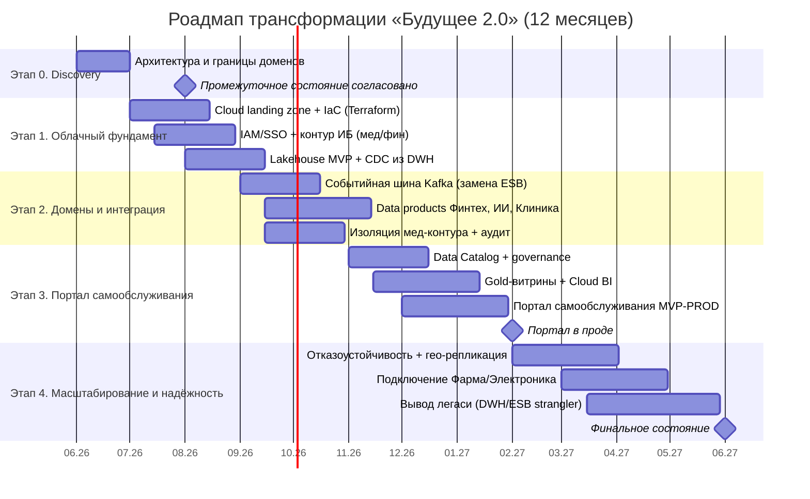

# Задание 3. Технологический радар и роадмап изменений — «Будущее 2.0»

Документ опирается на целевую архитектуру [Task1](../Task1/README.md) и доменную модель [Task2](../Task2/README.md) и состоит из трёх частей:
1. [Технологический радар](#1-технологический-радар) — текущие и предлагаемые технологии с привязкой к бизнес-сценариям.
2. [Роадмап изменений](#2-роадмап-изменений-технологического-ландшафта) — этапы с привязкой к бизнес-целям, результатами, командами и ресурсами.
3. [Обоснование этапов](#3-обоснование-этапов-с-точки-зрения-бизнеса) с точки зрения бизнеса.

---

## 1. Технологический радар

Радар построен в классической нотации (ThoughtWorks):
- **Кольца (зрелость решения для нас):** `Adopt` — внедряем/целевое; `Trial` — пилотируем на реальных задачах; `Assess` — исследуем; `Hold` — не развиваем / выводим.
- **Квадранты:** `Языки и фреймворки`, `Инструменты`, `Платформы`, `Техники и методологии`.

Каждая запись помечена статусом: 🟢 новое/целевое, 🔵 остаётся, 🔴 легаси/вывод.

### 1.1. Квадрант «Языки и фреймворки»

| Технология | Кольцо | Статус | Поддерживаемый бизнес-сценарий |
|---|---|---|---|
| Python (ИИ-сервисы, PySpark) | Adopt | 🔵 | ИИ-диагностика; трансформации данных в пайплайнах |
| Golang / Java (финтех) | Adopt | 🔵 | Независимое развитие финтех-сервисов |
| SQL / dbt (модели данных) | Adopt | 🟢 | Версионируемые витрины для быстрой отчётности |
| Spark (Scala/Python) | Adopt | 🟢 | Обработка сотен ТБ для отчётности без часов ожидания |
| **PowerBuilder** | Hold | 🔴 | Легаси-интерфейс оператора — выводится |
| **T-SQL бизнес-логика в DWH** | Hold | 🔴 | Логика выносится в домены/пайплайны (снятие зависимости от DWH) |

### 1.2. Квадрант «Инструменты»

| Технология | Кольцо | Статус | Поддерживаемый бизнес-сценарий |
|---|---|---|---|
| dbt (трансформации/контракты) | Adopt | 🟢 | Контракты данных доменов, быстрый вывод витрин |
| Apache Airflow (оркестрация) | Adopt | 🟢 | Регулярная подготовка gold-витрин → быстрая отчётность |
| Debezium (CDC) | Adopt | 🟢 | Миграция данных из DWH без правок логики (strangler) |
| Terraform (IaC) | Adopt | 🟢 | Воспроизводимые среды доменов, масштабирование (см. Task4) |
| DataHub / OpenMetadata (каталог) | Trial | 🟢 | Self-service: поиск данных и lineage в портале |
| Power BI | Trial | 🔵 | Переходная отчётность; постепенная замена облачным BI |
| Cloud BI (self-service) | Trial | 🟢 | Портал самообслуживания, конструктор отчётов |
| Vault / KMS (секреты, ключи) | Adopt | 🟢 | ИБ мед/фин данных, комплаенс |
| Prometheus + Grafana (наблюдаемость) | Adopt | 🟢 | Надёжность и SLA критичных сервисов |

### 1.3. Квадрант «Платформы»

| Технология | Кольцо | Статус | Поддерживаемый бизнес-сценарий |
|---|---|---|---|
| Облачная инфраструктура (IaaS/PaaS) | Adopt | 🟢 | Эластичное масштабирование ресурсов под отчётность и новые бизнесы |
| Data Lakehouse (object storage + Trino/ClickHouse) | Adopt | 🟢 | Единая платформа данных вместо монолитного DWH; быстрая аналитика |
| Apache Kafka (событийная шина) | Adopt | 🟢 | Слабая связанность доменов, интеграция новых направлений |
| Kubernetes (контейнеры) | Trial | 🟢 | Независимый деплой доменных сервисов, отказоустойчивость |
| Keycloak (IAM/SSO) | Adopt | 🟢 | Единый доступ + RBAC/ABAC для портала и доменов |
| **DWH на SQL Server 2008** | Hold | 🔴 | Легаси-хранилище — strangler, вывод/перевод в источник истории |
| **ESB Apache Camel** | Hold | 🔴 | Синхронный хаб — заменяется событийной шиной |

### 1.4. Квадрант «Техники и методологии»

| Технология | Кольцо | Статус | Поддерживаемый бизнес-сценарий |
|---|---|---|---|
| Data Mesh (доменное владение данными) | Adopt | 🟢 | Независимое развитие направлений, масштабирование под фарму/электронику |
| Data Lakehouse (bronze/silver/gold) | Adopt | 🟢 | Быстрая подготовка отчётности на готовых витринах |
| Контракты данных (data contracts) | Adopt | 🟢 | Стабильная интеграция доменов без правок DWH |
| Strangler Fig (поэтапный вывод легаси) | Adopt | 🟢 | Безопасный переход с DWH/ESB без остановки бизнеса |
| Infrastructure as Code (GitOps) | Adopt | 🟢 | Воспроизводимость и масштабируемость сред (Task4) |
| Data Governance & privacy-by-design | Adopt | 🟢 | Комплаенс мед/фин данных, изоляция медданных от витрины |
| Zero Trust / разграничение контуров | Trial | 🟢 | ИБ финтех- и мед-контуров |
| Data Fabric (единый слой управления) | Assess | 🟢 | Возможное усиление governance при росте числа доменов |

> Сводно: **Hold/вывод** — PowerBuilder, T-SQL-логика в DWH, SQL Server 2008, ESB Camel. **Adopt/целевое** — Lakehouse, Data Mesh, Kafka, IaC/Terraform, облако, dbt/Airflow, IAM, governance.

---

## 2. Роадмап изменений технологического ландшафта

Горизонт — год, в привязке к контрольным точкам проекта: **промежуточное состояние** (через пару месяцев — архитектура согласована, границы доменов определены, запланированы проекты витрины) и **финальное состояние** (через год — портал работает, домены работают в новой архитектуре, легаси временно сохраняется).

### 2.1. Временная шкала (Gantt)

### 2.2. Детализация этапов

| Этап | Срок | Ключевые работы | Ожидаемый результат | Ответственные команды | Необходимые ресурсы |
|---|---|---|---|---|---|
| **0. Discovery и согласование** | мес. 0–2 | Утвердить целевую архитектуру, границы доменов, контракты данных, бэклог проектов витрины | Архитектура согласована, границы доменов определены, спланированы проекты (**промежуточное состояние**) | Архитекторы, владельцы доменов, бизнес-стейкхолдеры | Архитектор данных, аналитики; бюджет на дискавери |
| **1. Облачный фундамент** | мес. 1–3 | Cloud landing zone, IaC/Terraform, сети/NAT, IAM/SSO, контур ИБ, Lakehouse MVP, CDC из DWH | Облако и платформа данных готовы; данные DWH реплицируются без правок логики | Платформенная команда (D-PLATFORM), ИБ, DevOps | Облачные ресурсы (VM, object storage, сеть), лицензии IAM, инженеры платформы/DevOps |
| **2. Домены и интеграция** | мес. 3–6 | Kafka вместо ESB, публикация data products (Финтех/ИИ/Клиника), изоляция мед-контура и аудит | Домены публикуют данные независимо; новая логика в DWH не добавляется; медданные изолированы | Доменные команды (D-FIN, D-AI, D-CLINIC), платформа, ИБ | Доменные дата-инженеры, Kafka-кластер, мощности под пайплайны |
| **3. Портал самообслуживания** | мес. 6–9(→11) | Data Catalog, governance, gold-витрины, Cloud BI, портал (MVP→PROD) | Сотрудники строят отчёты сами в пределах доступа; отчёты за секунды/минуты (**портал в проде**) | Платформа, BI-команда, доменные команды, ИБ | Frontend/BI-разработчики, лицензии Cloud BI/каталога, compute под витрины |
| **4. Масштабирование и надёжность** | мес. 9–12 | Отказоустойчивость и гео-репликация критичных систем, подключение Фарма/Электроника, вывод легаси | Новые бизнесы подключены по Data Mesh; SLA критичных сервисов; легаси выведено/локализовано (**финальное состояние**) | Платформа, ИБ, новые доменные команды, владельцы легаси | Гео-распределённые ресурсы, backup/DR, бюджет миграции и вывода легаси |

---

## 3. Обоснование этапов с точки зрения бизнеса

| Этап | Зачем нужен бизнесу | Влияние на цели (скорость решений / качество сервиса / затраты / масштабирование) |
|---|---|---|
| **0. Discovery и согласование** | Без согласованных границ доменов и контрактов любая стройка приведёт к новому монолиту. Этап фиксирует «правила игры». | **Скорость решений ↑** (нет переделок), снижает риск дорогих ошибок проектирования. |
| **1. Облачный фундамент** | Эластичные ресурсы и единая платформа данных снимают зависимость от устаревшего «железа» и монолитного DWH; контур ИБ — обязательное условие работы с мед/фин данными у регулятора. | **Затраты ↓** (отказ от поддержки легаси-железа), **масштабирование ↑** (эластичность), **качество/комплаенс ↑** (ИБ с первого дня). |
| **2. Домены и интеграция** | Событийная шина и data products разрывают связанность через DWH/ESB — направления развиваются параллельно; изоляция медданных закрывает регуляторный риск. | **Time-to-market ↑** (домены релизят независимо), **качество мед/фин сервисов ↑**, **масштабирование ↑** (готовность к новым доменам). |
| **3. Портал самообслуживания** | Прямая цель проекта: сотрудник сам получает отчёт по любым срезам в пределах доступа; отчёты больше не строятся часами. | **Скорость управленческих решений ↑↑** (отчёты за минуты), снимается «бутылочное горло» BI-команды, **выручка ↑** за счёт скорости вывода аналитики. |
| **4. Масштабирование и надёжность** | Подключение фармы/электроники по единой модели = рост экосистемы без переписывания центра; отказоустойчивость защищает критичные мед/фин сервисы; вывод легаси убирает техдолг. | **Масштабирование ↑↑**, **надёжность/SLA ↑**, **затраты ↓** (финальный вывод легаси), снижение операционных и регуляторных рисков. |

### 3.1. Связь радара и роадмапа
- Технологии из кольца **Hold** (PowerBuilder, T-SQL-логика, SQL Server 2008, ESB) выводятся на этапах 2 и 4 по принципу **Strangler Fig** — без остановки бизнеса.
- Технологии **Adopt** (Lakehouse, Data Mesh, Kafka, Terraform, IAM, dbt/Airflow) внедряются на этапах 1–3 и формируют фундамент портала и независимых доменов.
- Технологии **Assess/Trial** (Data Fabric, Cloud BI, каталог, K8s) пилотируются и масштабируются по мере роста числа доменов на этапах 3–4.

---

### Связь с другими заданиями
- Целевая архитектура и приоритизация — [Task1](../Task1/README.md).
- Домены и потоки данных (DFD) — [Task2](../Task2/README.md).
- Реализация облачного фундамента (этап 1) через Terraform/IaC — Task4.
